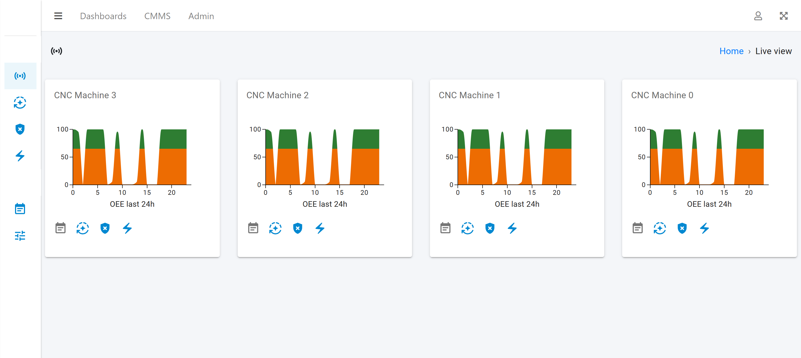
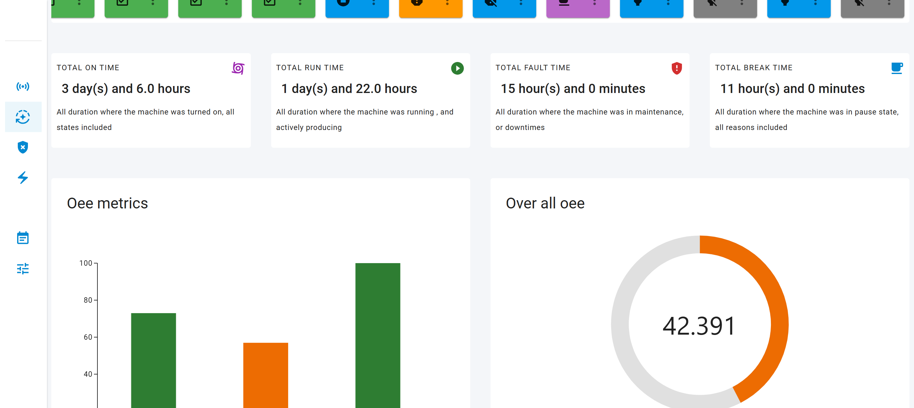
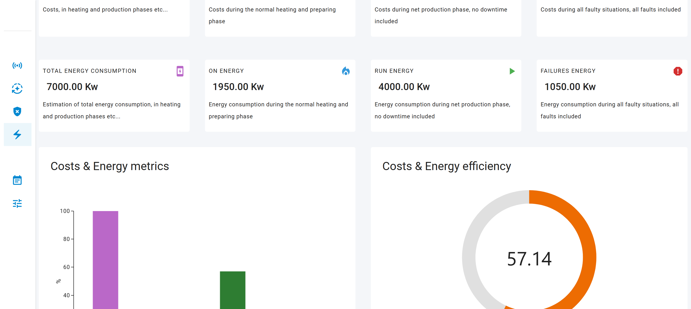
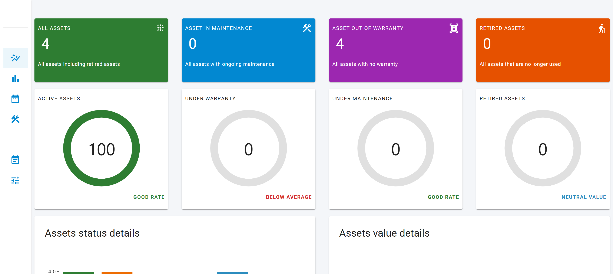
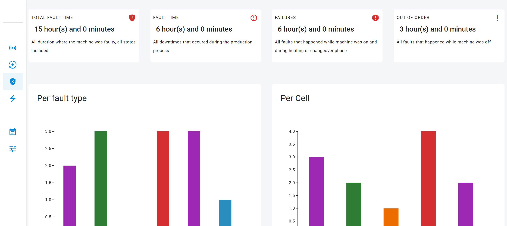

# OEE and CMMS Software


# Description
## Manufacturing Efficiency & Maintenance Management Platform  

This project is a **manufacturing efficiency and maintenance management platform** designed to help factories track **Overall Equipment Effectiveness (OEE)** and manage maintenance tasks using a **Computerized Maintenance Management System (CMMS)**. It provides real-time insights into machine performance, downtime, and maintenance schedules to improve productivity and reduce operational costs.  
## Demo app
* You can access to a [deployed app](https://app.opensourceoeesoftware.com)
* You can use this crendentials for a demo account **username**: demo_user, **password** oeesoftwaredemo
* This app is deployed in an EC2 AWS instance only for demo purposes and it is not expected to maintenance performances under stress

## Key Features  
✔ **OEE Tracking**: Measures **Availability, Performance, and Quality** of production lines.  
✔ **CMMS Functionality**: Tracks **maintenance tasks, schedules,Agenda, and work orders**.  
✔ **Live Data Monitoring**: **Real-time** data visualization for factory managers.  
✔ **Multi-User Access**: **Role-based authentication** and user management.  
✔ **Scalable Architecture**: Built with **Django/Python (backend)** and **ReactJS (frontend)** for flexibility and performance.  
✔ **Containerized Deployment**: Uses **Docker and Nginx** for easy setup and scaling. 

## Project Status  

🚧 **This project is in the early stages of development.** 🚧  
Some features may be incomplete or subject to change. Contributions, feedback, and suggestions are welcome as the project evolves.

# Getting Started

## Stack
* Backend : Django/Python, Redis as message broker
* Frontend : ReactJS, Mostly MUI 
* Deployment & containerization: Docker, Docker-compose, and Nginx as a reverse proxy
* Database: PostgresSQL
* Prod Deployment : EC2, Loadbalancer, RDS (AWS)

## Dependencies
* Make sure you have a computer with some kind of IDE installed in it.[VS Code for example](https://code.visualstudio.com/download)
* Make sure you have docker and docker compose installed, check [This Tutorial](https://docs.docker.com/compose/install/)
* Make sure you have Nodejs and npm installed, check [This Tutorial](https://docs.npmjs.com/downloading-and-installing-node-js-and-npm)


## Run the software locally

* in the backend directory create a .env file, here is the format
```python
#This is for the postgres image
POSTGRES_DB=database_portfolio 
POSTGRES_USER=postgres
POSTGRES_PASSWORD=password

SECRET_KEY='django-insecure'
DEBUG=True
#Email CONFIG for account creation and password reset
EMAIL_HOST=mail.mail.io
EMAIL_HOST_USER=mail@mail.io
EMAIL_HOST_PASSWORD=password

#DB CONFIG Should match with the one in the top
DB_HOST=portfolio_db
DB_USER=postgres
DB_NAME=database_portfolio
DB_PASSWORD=password
```

* Build and run the containers using the command `docker-compose up --build`, the `--build` flag is used mostly in the first time to build the images or when you change the Dockerfile of images , for code changes and editing you can simply run the command without the `--build` flag, volumes are there for this reason

* In a seperate shell we need to run some migrations for the database to create the nessessary tables, for that we need to excute :
```
docker-compose run portfolio_web python manage.py makemigrations db state
docker-compose run portfolio_web python manage.py migrate
```
and it should look like this :
```
Applying db.0001_initial... OK
Applying django_rest_passwordreset.0001_initial... OK
Applying django_rest_passwordreset.0002_pk_migration... OK
Applying django_rest_passwordreset.0003_allow_blank_and_null_fields... OK
Applying django_rest_passwordreset.0004_alter_resetpasswordtoken_user_agent... OK
Applying sessions.0001_initial... OK
Applying sites.0001_initial... OK
Applying sites.0002_alter_domain_unique... OK
Applying state.0001_initial... OK
```
* You can now navigate to [Registration page](http://localhost/register) to create an account.

* After account creation, you can run `docker-compose run portfolio_web python manage.py populate` to create demo data. it might take few minutes

* If you are planning to use the django admin site, you need to run the following commands, to collect static files, and create super user 
```
docker-compose run portfolio_web python manage.py collectstatic
docker-compose run portfolio_web python manage.py createsuperuser
```
You can then login the [Admin panel](http://localhost/admin)

* You can also use the oee.service to automatically start in an ubuntu server
```ini
[Unit]
Description=OEE software service #service name
After=multi-user.target
[Service]
Type=simple
Restart=always
WorkingDirectory=/home/ubuntu/portfolio #might need to specifiy another path
ExecStart=/usr/bin/docker-compose up #same apply here depending on linux version
[Install]
WantedBy=multi-user.target
```
* You can run the following commands to enable the service to start automatically in case the server is restarted
```
sudo cp oee.service /etc/systemd/system/oee.service
sudo systemctl daemon-reload
sudo systemctl start oee.service
sudo systemctl enable oee.service
```


## CI/CD
GitHub workflows are used for the pipeline, the steps are :

1. Installing docker and docker compose
2. Building and running the images
3. Running Database migrations
4. Running Unit tests

## Deployment (AWS)
This is a quick way to deploy this django app to cloud provider AWS using ElasticBeanstalk, this will create
* A load balancer
* An RDS instance
* An EC2 instance in an autoscale group 

### Prerequisites
1. Installed and configured [awsebcli](https://docs.aws.amazon.com/elasticbeanstalk/latest/dg/eb-cli3-install.html)
2. Aws account (already setup)
3. Make sure that the project settings are suitable for production, here some of them

```python

#HTTPS SETTINGS
SECURE_SSL_REDIRECT = True
SESSION_COOKIE_SECURE=True
CSRF_COOKIE_SECURE = True
#HSTS SETTINGS
SECURE_HSTS_SECONDS = 60
SECURE_HSTS_PRELOAD = True
SECURE_HSTS_INCLUDE_SUBDOMAINS = True
```

### Configuration
#### Generate client data
Make sure to creat an .env file with the proper values
1. In the backend directory, go to aws_deploy.py and define this following paramters
```python
#aws variables
ENV_NAME = 'portfolio-app'
RDS_TYPE = 'db.t3.micro'
```
2. Run the following command to start the deploy process
```sh
python aws_deploy.py
```
Note: in the console you will be asked to add a database name and a password.
**Make sure to save all paramters in a safe files as well as the database credentials and delete them from the deploy.py**

3. Go to aws console and add HTTPS listner and ssl certificates
4. Go to domaine name provider and add a CNAME Record for the new deployed app

## Screenshots






## Authors

Contributors names and contact info

Djebab Toufik  [GitHub](https://github.com/djebabToufik)

## Version History

* 0.1
    * Initial Release

## License

This project is licensed under the  License - see the LICENSE.md file for details

